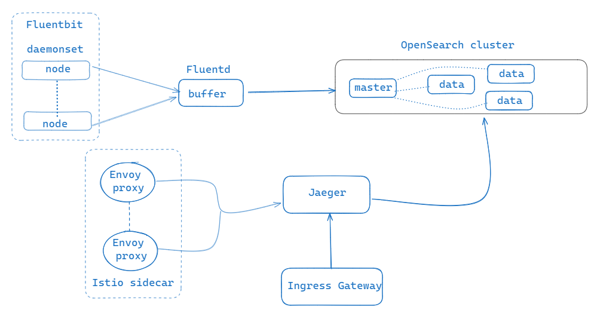

# Logging chain

```
LOG COLLECTOR --> FluentBit (ds)
LOG AGGREATOR/PROCESSOR --> Fluentd (deployment/sts)
LOG STORAGE/SEARCH --> OpenSearch (sts)
```




## Setup Quick install

```bash
helm upgrade -i fluentbit charts/fluent-bit
helm upgrade -i fluentd charts/fluentd
helm upgrade -i opensearch charts/opensearch

# check fluentd config at runtime: 01_sources.conf or 04_outputs.conf
kubectl exec -c fluentd $(kubectl get po -l app.kubernetes.io/instance=fluentd -oname) -- ls /etc/fluent/config.d/

# port forward to opensearch cluster
kubectl port-forward svc/opensearch-cluster-master 9200:9200

# check cluster health
curl -k -u `admin:INSERTPASSORDHERE` "https://localhost:9200/_cluster/health?pretty"

# check indices (you should see kubernetes-logs-YYYY-MM-DD)
curl -k -u admin:INSERTPASSORDHERE "https://localhost:9200/_cat/indices?v&pretty"

# deploy a workload (i.e. a counter pod)
kubectl apply -f https://raw.githubusercontent.com/dejanu/k8s_logging/refs/heads/main/counter_pod.yaml

# after a couple of minutes check in opensearch your index, i.e.: kubernetes-logs-2025.08.13
curl -k -u admin:INSERTPASSORDHERE "https://localhost:9200/kubernetes-logs-2025.08.13/_search?size=3&sort=@timestamp:desc&pretty"
```

## Motivation

Treasure Data: FluentBit is to FluentD what Beats are to Logstash...Charts [here](https://github.com/fluent/helm-charts)

Both Fluentd and Fluent Bit can work as Aggregators or Forwarders, and can complement each other or be used as standalone solutions.
More [here](https://docs.fluentbit.io/manual/about/fluentd-and-fluent-bit)

* FluentBit: lightweight forwarder (450KB - 1 MB) translating into `memory: 128Mi` and `cpu: 100m` with a variety of input plugins. Uses [tail input plugin](https://docs.fluentbit.io/manual/data-pipeline/inputs/tail) to tail `/var/log/containers/*.log` and forwards to fluentd using [forward output plugin](https://docs.fluentbit.io/manual/data-pipeline/outputs/forward)...stream data to fluentd.
Fluentbit it uses parsers to make sense of raw log files,filters to enrich logs and outputs

```yaml
[INPUT]
  Name    tail
  Path    /var/log/myapp.log
  Tag     myapp.log
  Parser  json

[FILTER]
  Name    modify
  Match   myapp.log
  Add     hostname ${HOSTNAME}

[OUTPUT]
  Name    es
  Match   myapp.log
  Host    elasticsearch.local
  Port    9200
  Index   myapp-logs
```

* Fluentd: aggregator (40 MB - 60 MB ) translating into into `memory: 128Mi` and `cpu: 10m`. Does buffering (in-memory or file based), retries, routing, filtering.

* A word about [buffering](https://github.com/dejanu/k8s_logging/blob/main/buffering.md) 

* OpenSearch: storage and search engine

## Troubleshooting

* Fluentd is not able to connect to OpenSearch:
```bash
#0 Could not communicate to OpenSearch, resetting connection and trying again. [401] Unauthorized
...
```
Solution start session in opensearch-master pod `kubectl exec -it opensearch-cluster-master-0 -- sh` and execute security admin (plugin includes demo certificates so that you can get up and running quickly)
```bash
/usr/share/opensearch/plugins/opensearch-security/tools/securityadmin.sh -cd "/usr/share/opensearch/config/opensearch-security" -icl -key "/usr/share/opensearch/config/kirk-key.pem"   -cert "/usr/share/opensearch/config/kirk.pem" -cacert "/usr/share/opensearch/config/root-ca.pem" -nhnv
```


### OpenSearch sizing

* OpenSearch calculator [here](https://dejanu.github.io/oscalculator.html)