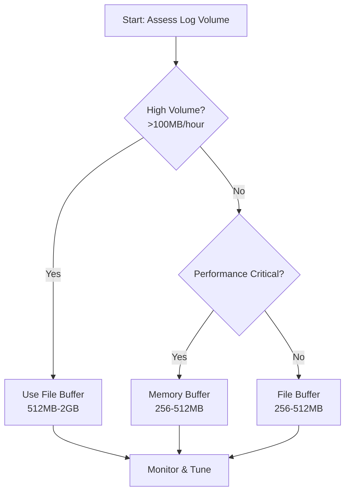

## Buffering

BUFFERING = A mechanism to place process data into a temporary location until is ready to be shipped. More about buffering [here](https://docs.fluentd.org/buffer)

CHUNK = group of events/records/array of json objects.

Fluentbit collects, parses, filters and ships logs. A central piece of this workflow is the ability to do buffering.
When an input plugin source emits records -->  Fluentbit engine groups the records together in a chunk
A chunk's size usually is around 2 MB [fluentbit chunk size](https://docs.fluentbit.io/manual/administration/buffering-and-storage)


Fluentd collects log lines and puts them in chunks. These chunks are then buffered before being sent to the output destination.
Fluentd buffers data in memory (by default) or on disk (file) before sending it to the output destination. 

The bufer size can be configured, and can be flushed to the output destination when it reaches a certain size or after a certain time period.


Buffering is done using buffer plugins. These buffers are configurable parameters [here](https://docs.fluentd.org/configuration/buffer-section#buffering-parameters) and 
Events are grouped into chunks and placed in a buffer, the defaults fluentd:

    - chunk_limit_size: 8MB (memory) / 256MB (file) (size of chunk)
    - total_limit_size: 512MB (memory) / 64GB (file) (buffer size)
    - interval flushes per `flush_interval` (the time interval in which the buffer will be sent to the destination)

Check buffer config `kubectl -n logging exec -c fluentd $(kubectl -n logging get po -l app.kubernetes.io/instance=fluentd -oname) -- cat /etc/fluent/config.d/fluent.conf`

[fluentbit](https://docs.fluentbit.io/manual/administration/buffering-and-storage#filesystem-buffering): Filesystem buffering helps with backpressure and overall memory control.
Enable it using `storage.type filesystem`  and `<buffer> @type file` for fluentd.

---

## Choosing you buffer 

* Asses your daily log volume: 
```bash
# Estimate daily log volume per pod
kubectl logs <pod-name> --since=1h | wc -c  # bytes in 1 hour
# Multiply by 24 for daily estimate
```

* Check current index sizes in OpenSearch
```bash
curl -k -u admin:INSERTPASSWORD "https://localhost:9200/_cat/indices/kubernetes-logs-*?v&h=index,store.size,docs.count"
```

* Determine OpenSearch outage duration and peak log rate
```bash
Buffer Size = Peak Log Rate × Outage Duration
Example: 140KB/s × 1800s (30 min) = ~252MB
```
* Choosing the buffer type:

For file buffering, you can use:
```xml
<buffer>
  @type file
  chunk_limit_size 32m     # ← Start with 16-64MB per chunk
  queue_limit_length 16    # ← Adjust based on total target size
  # Total = 32MB × 16 = 512MB
</buffer>
```

For memory buffering, you can use:
```xml
<buffer>
  @type memory
  total_limit_size 1024m   # ← Direct total size control
  chunk_limit_size 64m
  compress gzip            # ← Increases effective capacity
</buffer>   
```

* Solutions

Buffer overflow errors → Increase size
High memory usage/ Data loss on restarts or Opensearch rejecting logs → Switch to file buffering
Slow flush times → Reduce chunk size

